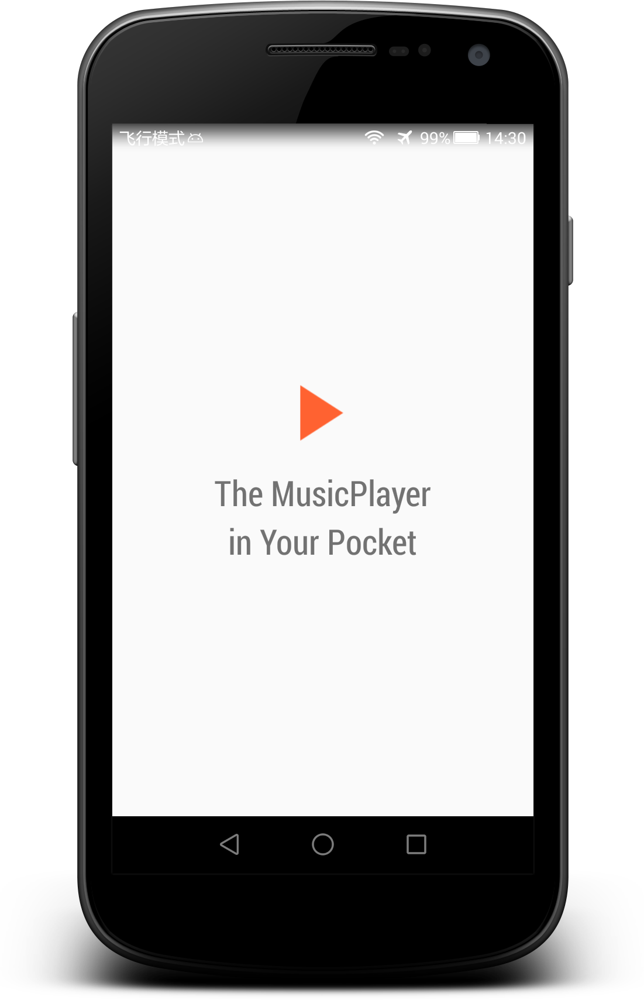

# MusicPlayer

## Introduce

> 
>How about building a simple music player?
> 

I started this project since I finished the elemental classes of Android. I looked forward to doing some demos that would help enhance my understanding of Android.

## Content

Service, BroadcastReceiver, ContentProvider, Intent, and of course, Activity will be used in this project, and these five are the most important point in Android development.

## Screenshots

